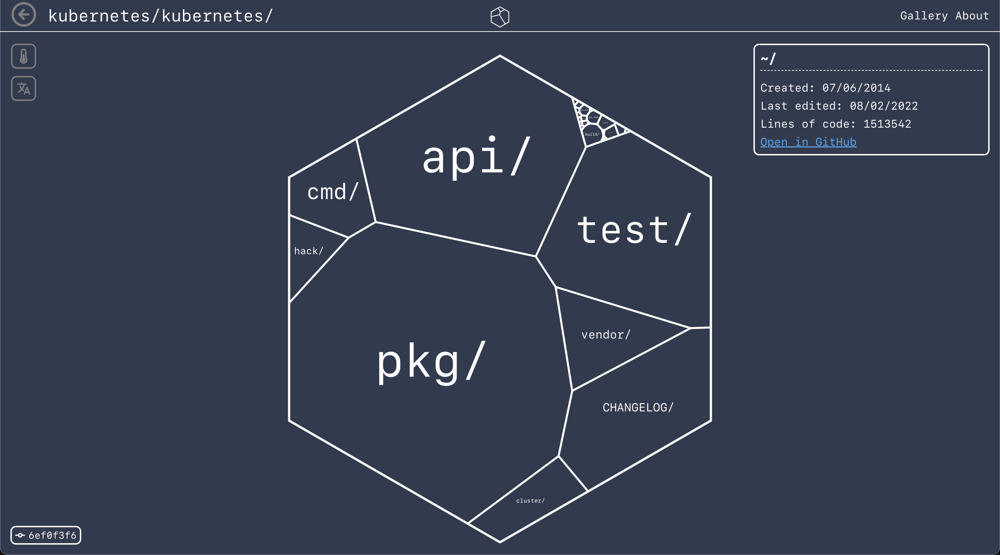

# Codeatlas codebase-visualizer-action

> Codeatlas visualizes codebases.



The codebase-visualizer-action creates a visualization of your codebase and makes it available at `https://codeatlas.dev/github/<REPO_OWNER>/<REPO_NAME>/<?COMMIT_OR_BRANCH>`. 

Explore sample visualizations of well-known open-source projects in our [gallery](https://codeatlas.dev/gallery)!

>**Note**: The codebase-visualizer-action is **currently in beta**. If visualisation for your repo fails for some reason, please consider opening an issue with a link to your workflow run so we can fix the problem!
## Usage
To add Codeatlas to your Actions pipeline, specify the name of this repo with a tag (currently only @v1-beta is available) as a step in the `workflow.yml` file. 

`Settings - Actions - General - Allow GitHub Actions to create and approve pull requests` needs to be activated! If your repo is part of a GitHub organisation, this needs to be enabled in the organisation settings.

Also note that at the moment this action assumes your Github runner's UID/GID pairing to be 1001:121 (the standard Github config). Self-hosted runners might not work for that reason! 

Add to `workflow.yml` like this:

```
steps:
  - uses: actions/checkout@v3
  - uses: codeatlasHQ/codebase-visualizer-action@v1-beta
  	with:
  	  sub_directory: src/example/  # optional
```

>**Note**: Don't forget to add the `actions/checkout@v3` action step to checkout your repo on the Github Action runner before!

The action will then run the main Codeatlas Docker image (maintained in the [codebase-tessellator](https://github.com/codeatlasHQ/codebase-tessellator) project) to create a snapshot of the repo.

Upon a successful run, `codeatlas-bot` will create a branch named `codeatlas-preview` and add the data necessary for the visualization to the `.codeatlas` directory. It will then raise a PR to add this visualization snapshot data to your default branch. The bot will keep updating and overwriting the same PR everytime the action runs. After merging this PR, the interactive visualization will become available at `https://codeatlas.dev/github/<REPO_OWNER>/<REPO_NAME>/<?COMMIT_OR_BRANCH>`.

**How often to trigger?**

In our experience it's overkill to visualize a project with every push-event. In order to be mindful of CI minutes, we'd recommend using either:
1) the `on: [tag]` workflow trigger to update the visualization on each release or
2) the `on: [workflow_dispatch]` trigger to run the action manually and update the visualization whenever you want.

See [this repo](https://github.com/codeatlasHQ/flask) for a working setup.

## Private Repositories
This action does not yet support private repositories! The action should run through, but you will not be able to access your visualizations through codeatlas.dev.

## Arguments

| Input | Description | Default |
| :---:     |     :---:   |    :---:   |
| `sub_directory` | (Optional) Specify the root directory of your codebase. No leading slash allowed. | "" |

## Roadmap
Check out our roadmap on Trello: https://trello.com/b/jg1kn5c2/codeatlas-roadmap

